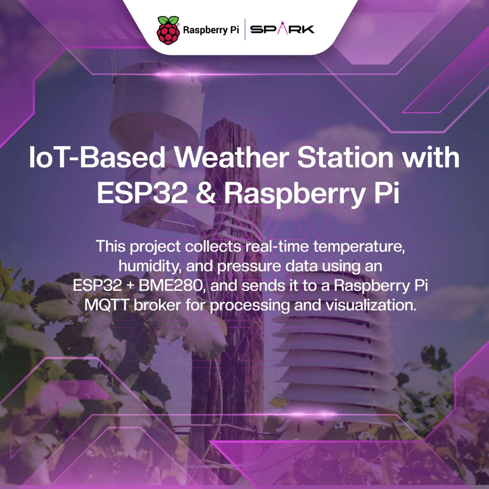
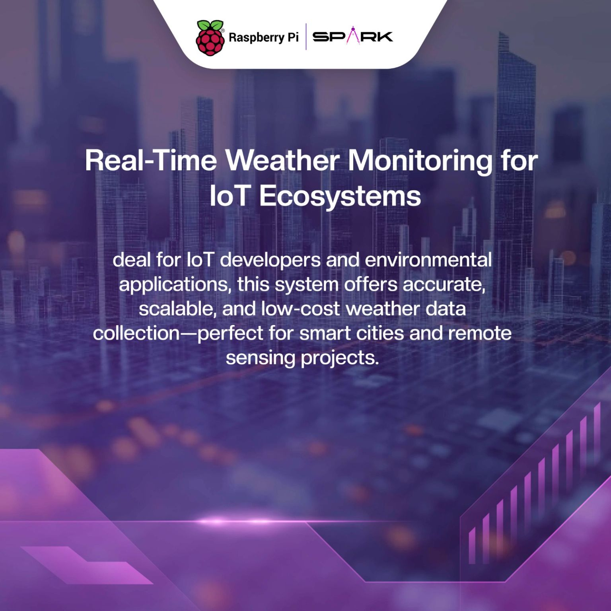
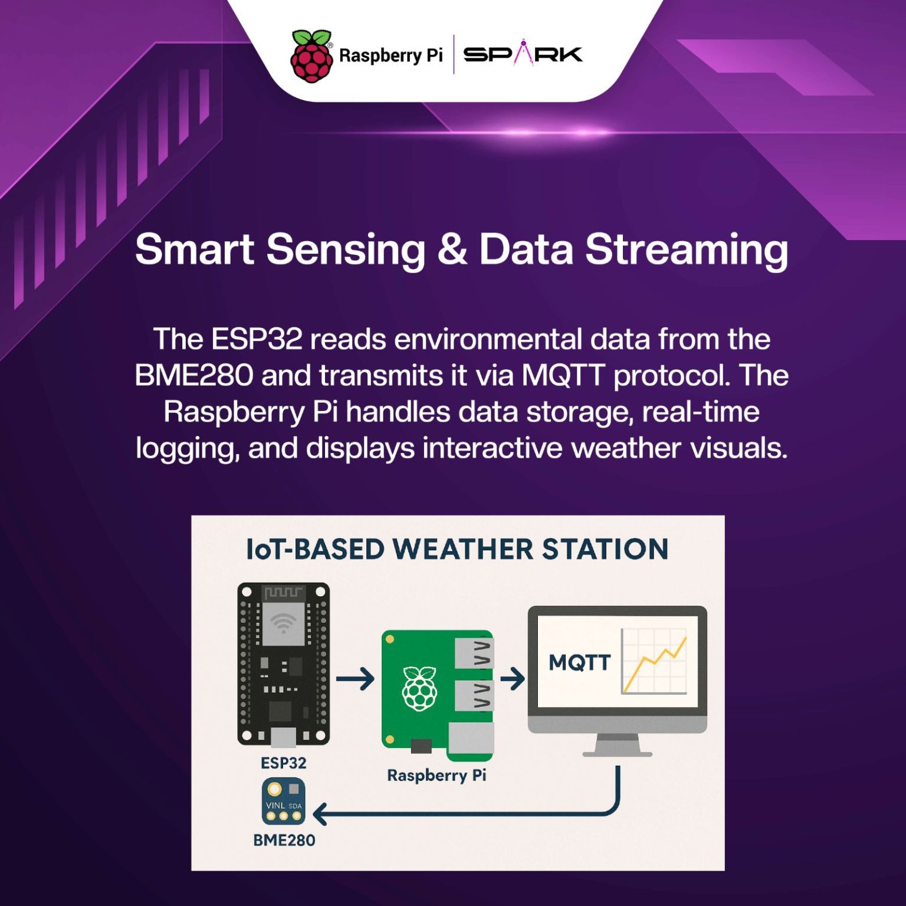

# IoT_Weather_Station
An IoT-based weather station using an ESP32, Raspberry Pi, and BME280 sensor. The ESP32 reads temperature, humidity, and pressure data from the BME280 and publishes it via MQTT. The Raspberry Pi acts as the MQTT broker and processes the data for logging and visualization. Ideal for real-time weather monitoring and IoT applications.

